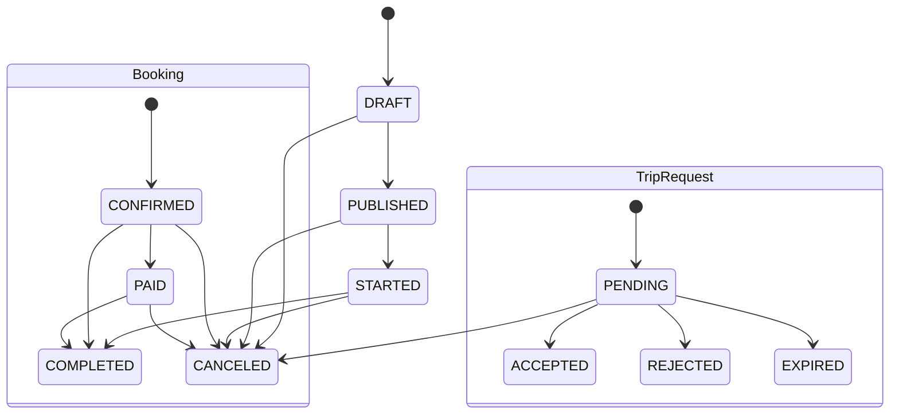
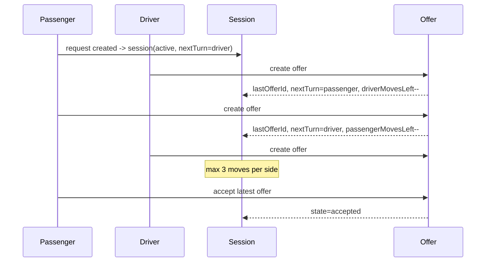

# Diagrams

## Trip / Request / Booking states


## Negotiation flow (turn-based)


## Outbox flow
```mermaid
flowchart TD
  A[Domain transaction] --> B[OutboxEvent insert]
  B --> C[Outbox dispatcher]
  C --> D[Queue job (BullMQ)]
  D --> E[Worker handler]
  E --> F[Notification/Audit/Side effects]
```
